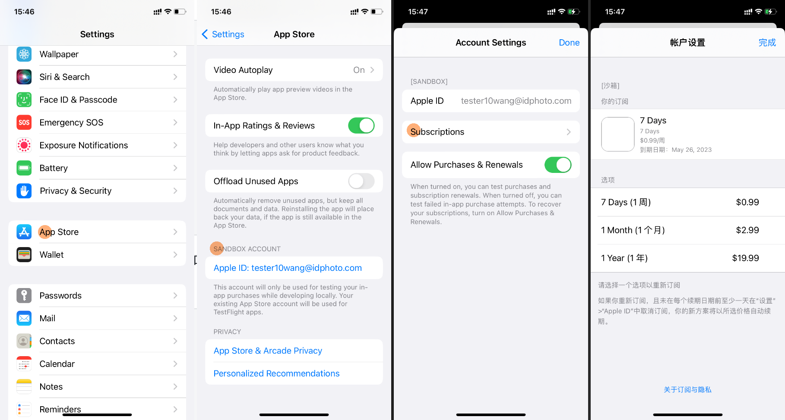

# {{ $frontmatter.title }}

{{ $frontmatter.description }}

## Creating a Sandbox User

One of the challenges of testing subscriptions is that the shortest subscription period is one week. Does this mean that if I subscribe to a product and then unsubscribe, I have to wait a week to verify if the backend handles the unsubscription properly?

The answer is no. We can create a sandbox user (Sandbox Tester) on the [App Store Connect > Users > Sandbox](https://appstoreconnect.apple.com/access/users/sandbox) page. A few minutes for a sandbox user equals one month in the real world. Additionally, if the sandbox user subscribes to a product, it will be automatically renewed up to 6 times. Therefore, after a few hours, the sandbox user will automatically unsubscribe from the product.

| Production Subscription Period | Sandbox Subscription Renewal | TestFlight Subscription Renewal |
|---------------------------------|------------------------------|---------------------------------|
| 3 days                          | 2 minutes                    | 1 day                           |
| 1 week                          | 3 minutes                    | 1 day                           |
| 1 month                         | 5 minutes                    | 1 day                           |
| 2 months                        | 10 minutes                   | 1 day                           |
| 3 months                        | 15 minutes                   | 1 day                           |
| 6 months                        | 30 minutes                   | 1 day                           |
| 1 year                          | 1 hour                       | 1 day                           |
> https://www.revenuecat.com/docs/test-and-launch/sandbox/apple-app-store#working-with-subscriptions

## Logging in as a Sandbox User

Please log in to the sandbox account you just created on your iPhone at Settings > App Store > Sandbox Account. You can manage the current sandbox account’s subscriptions from this page.  

## Testing Subscriptions

Note: Sandbox users are only used when the app is installed via Xcode. Apps installed through TestFlight do not use a sandbox account; instead, they use the Apple ID currently logged in on the iPhone.

1. Write the code to implement the subscription feature.
2. Install the app via Xcode.
3. Click the subscription button in the app, and the payment interface will pop up. After payment, the subscription status should change to "Subscribed."
4. Force close the app, then reopen it. The subscription status should still be "Subscribed."

## Testing Unsubscribing

1. Go to Settings > App Store > Sandbox Account to unsubscribe from the product you just subscribed to.
2. After 10 minutes, reopen the app. The subscription status should change to "Not Subscribed."

## Testing Subscription Recovery

1. Subscribe to the product again.
2. Uninstall the app.
3. Reinstall the app, and the subscription status should be "Not Subscribed."
4. Click the "Restore Subscription" button, and the subscription status should change to "Subscribed."