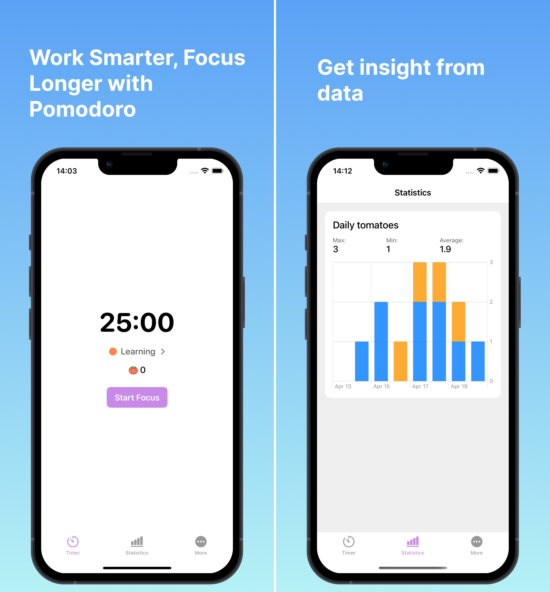

# {{ $frontmatter.title }}

{{ $frontmatter.description }}

Features:

- Pomodoro Technique: Work in focused 25-minute sessions, followed by a 5-minute break.

- Notifications: Get timely reminders to start your work and take breaks—never miss a session.

- Track Your Progress: Monitor your productivity with detailed session logs and daily statistics.

- Simple, Intuitive Design: A clean, easy-to-use interface to help you stay focused without distractions.

Whether you're working, studying, or tackling personal projects, My Tomatoes is here to help you stay on task and make every minute count.

Get started today and take control of your productivity with My Tomatoes—because your time is valuable!

