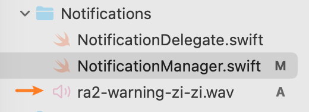

# {{ $frontmatter.title }}

{{ $frontmatter.description }}

1. Add audio files to the Xcode project
   
2. Set notification sound
   ```swift
    let content = UNMutableNotificationContent()
    content.title = title
    content.body = body
    content.sound = UNNotificationSound(named: UNNotificationSoundName(rawValue: "ra2-warning-zi-zi.wav"))
   ```