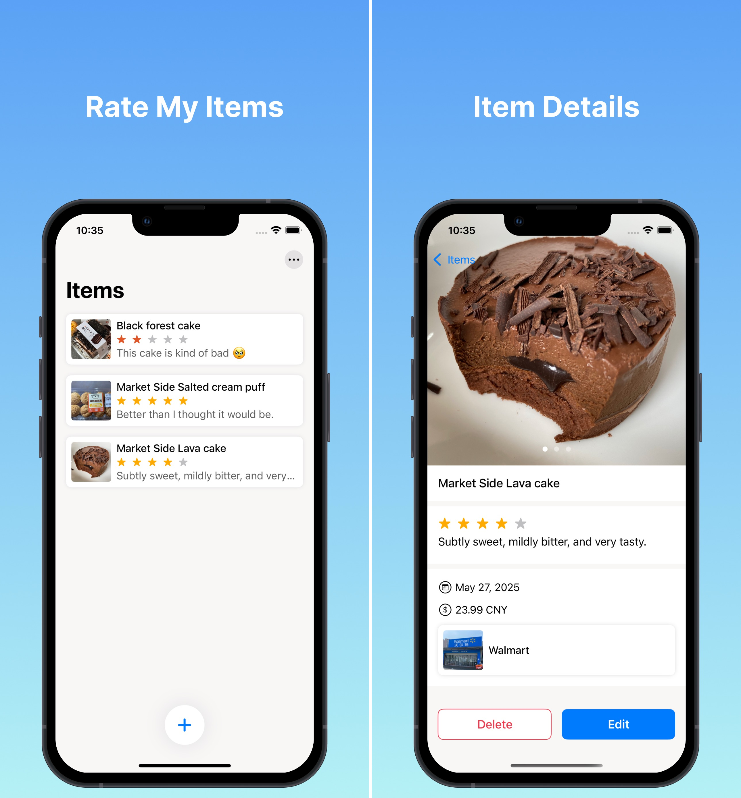

# {{ $frontmatter.title }}

{{ $frontmatter.description }}

Ever bought something and thought, “That was amazing!” or “Never again”? With Rate My Items, you can easily record and reflect on your experiences with everyday things — from food and gadgets to clothing and more.

For example:

I bought a chocolate cake from Walmart for $23.99 — it was delicious!

Features:

Log items you’ve bought or used

Record the price, store, and your personal rating

Add notes or photos to remember what stood out

Look back anytime to make smarter future choices

Perfect for mindful shopping, foodies, or anyone who loves keeping track of what works and what doesn’t.

Start rating your world — one item at a time.

