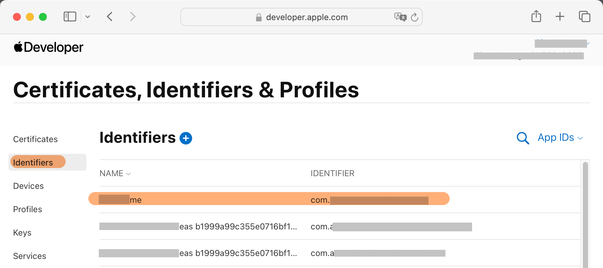
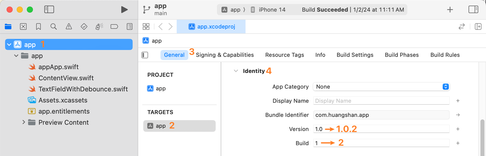

# {{ $frontmatter.title }}

{{ $frontmatter.description }}

## Goals

1. After pushing a `commit` to the `main` branch of the `GitHub repository`:

   ```bash
   git push
   ```
2. Xcode Cloud should automatically start building the app and publish the build to `TestFlight`.

## Prerequisites

1. Your `Apple ID` has joined the [Apple Developer Program](https://developer.apple.com/programs/)
2. A `GitHub` account

## Create an Xcode Project

### Create a New `Bundle ID`

Every Apple app has a unique ID, known as a `Bundle ID`. You can apply for this ID on the Apple Developer website: [Apple Developer > Account > Certificates, IDs & Profiles > Identifiers](https://developer.apple.com/account/resources/identifiers/list).


### Create an `App Store Connect App`

To publish your app to the `App Store`, you must use [App Store Connect](https://appstoreconnect.apple.com/). Tasks such as app updates, adding `TestFlight` testers, and viewing `Xcode Cloud` logs are all done through this site.

1. In the Apps page, click **New App**.
2. Fill out the New App form. You may wonder what to put for SKU — you can enter anything; typically, I just use the `Bundle ID`.
   

### Create the `Xcode` Project

1. Open `Xcode`, and create a new project.
2. Update the project's `Bundle ID` to the one you just created. Go to **Project Navigator** > `app.xcodeproj` > `Signing & Capabilities` > `Signing` > `Bundle Identifier`.
   
3. After changing the `Bundle ID`, `Xcode` will automatically fetch a provisioning profile. Click the `i` icon next to `Provisioning Profile`. If everything is checked, it was successful.
   
4. Run the project on an iOS simulator to confirm it runs correctly.

## Manual Build & Upload

::: warning
Before setting up `Xcode Cloud` auto-build, **you must complete a manual upload**. This ensures any problems you face during the cloud setup are truly due to `Xcode Cloud`, not the source code or `TestFlight`.
:::

### Set the App Icon

* This is **required**. Without an app icon, manual upload to `TestFlight` will fail.
* The image **must not have an alpha channel**. If your icon has transparency, `Xcode Cloud` will fail to build. You can convert the icon to `JPEG` format, which does not support alpha channels.

### Set Encryption Settings

Set the `ITSAppUsesNonExemptEncryption` key in your `Info.plist`.

* This key specifies your app’s encryption usage. If you're unsure, set it to `false`.
* This is **required**. Without it, you'll have to manually specify encryption settings in App Store Connect each time.

```xml
<dict>
   ...
   <key>ITSAppUsesNonExemptEncryption</key>
   <false/>
</dict>
```

### Build & Upload

1. Set `Run Destination` to `Any iOS Device`
2. Click **Product > Archive** from the top menu
3. After building, an `Archives` window will appear (you can also open it via **Window > Organizer**). Select the new archive, then click **Distribute App** to begin uploading to `TestFlight`.
   

### Create a TestFlight Testing Group

1. Once the `Archive` is uploaded, you’ll find it in [App Store Connect > TestFlight](https://appstoreconnect.apple.com/).
2. Create an `Internal Testing` group.
3. Add testers using their `Apple ID`. An invite will be sent to their associated email.

   * Note: If a tester isn’t part of your developer team, their `Apple ID` must be added as a team member first.

### Accept the TestFlight Invitation

1. Testers need to install the [TestFlight app](https://apps.apple.com/us/app/testflight/id899247664) on their device.
   
2. They should check their email and find the invitation from TestFlight.
3. Click **View in TestFlight** in the email, open the TestFlight app, and tap **Accept**. They’ll now see your app in TestFlight and will get updates when new versions are available.
   

### Upload Again

#### Bump the Version Number

To upload a **new version** to TestFlight, you must increase the version number in **Project Navigator > app.xcodeproj > General > Identity**, because TestFlight only accepts newer versions.


## Xcode Cloud Auto Build & Upload

Once the `Xcode Cloud workflow` is set up, any push to the `main` branch on GitHub will trigger an automatic archive build and upload to `TestFlight`.

### Auto Bump Version Number

According to [Apple's documentation](https://developer.apple.com/documentation/xcode/writing-custom-build-scripts), `Xcode Cloud` runs `ci_scripts/ci_post_clone.sh` before building.
You can write a `JavaScript` script in this file to bump the version number.

::: code-group
<<< ../codes/demo3-build-ios-app-with-xcode-cloud/ci_scripts/ci_post_clone.sh
<<< ../codes/demo3-build-ios-app-with-xcode-cloud/ci_scripts/changeAppInfo.mjs{js}
:::

### No Transparent Pixels in App Icon

App icons must **not** contain transparent pixels. You can convert the icon to `JPEG`, which does not support alpha channels.

### Create a GitHub Repository

1. Create a `main` branch and push it to GitHub.
2. (Optional) Create a `build_ios` branch used exclusively for triggering builds.

### Create an Xcode Cloud Workflow

1. In `Xcode` go to **Project Navigator > the rightmost tab > Cloud > Get Started**
   
2. Add an `Archive` action to the workflow. Set `Distribution Preparation` to `App Store Connect` since the build will eventually go to the App Store.
   
3. During the initial setup, authorize Xcode Cloud to access your GitHub repository.
   
4. Now, committing to the `main` branch will trigger the workflow. You can view the progress on [App Store Connect > Xcode Cloud](https://appstoreconnect.apple.com/).

### Auto Publish to TestFlight After Build

Although the workflow builds the archive, it doesn’t auto-publish by default.
Go to [App Store Connect > Xcode Cloud](https://appstoreconnect.apple.com/), open the workflow, and add a **Post-Action** of type **TestFlight Internal Testing**.
Select the testing group you created earlier. Now, every successful build will automatically be published to TestFlight.


## References

* [Configuring your first Xcode Cloud workflow | Apple](https://developer.apple.com/documentation/xcode/configuring-your-first-xcode-cloud-workflow)
