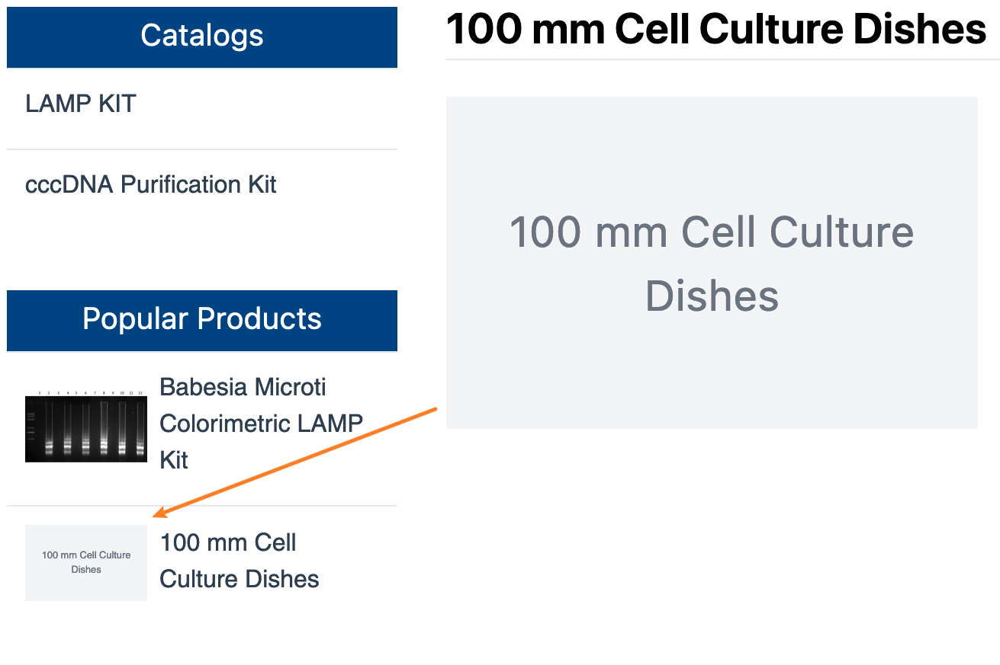

# {{ $frontmatter.title }}

{{ $frontmatter.description }}



```html
<svg xmlns="http://www.w3.org/2000/svg" viewBox="0 0 200 125">
    <foreignObject width="200" height="125" x="0" y="0">
        <div class="h-full flex justify-center items-center">
            <p class="text-16px text-center">
                YOUR_TEXT_HERE
            </p>
        </div>
    </foreignObject>
</svg>
```

- `viewBox` means that the canvas starts at (0,0) and has a length and width of 200 and 125
  
- `foreignObject` allows HTML elements to be placed in SVG

- `div` flex layout is used to center the text, if you are not familiar with this atomized style, you can take a look at [tailwind css](https://tailwindcss.com/). And this example is using [unocss](https://uno.antfu.me/)
