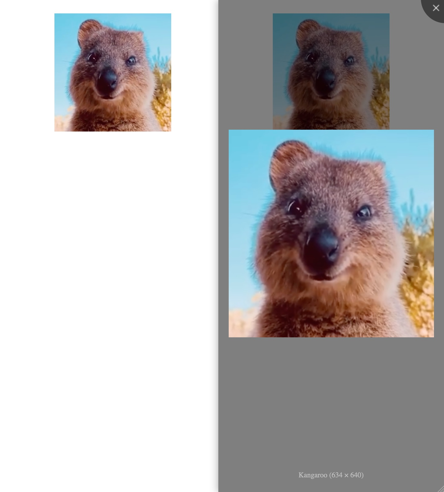

# {{ $frontmatter.title }}

[viewerjs](https://github.com/fengyuanchen/viewerjs) is an excellent image viewing plugin, today we will wrap it as a vue component



### Install

```bash
npm i viewerjs
```

### Encapsulate as component

```vue
<!-- ImageViewer.vue -->
<script setup lang="ts">
// https://github.com/fengyuanchen/viewerjs
import { onMounted, ref, watch } from 'vue'
import Viewer from 'viewerjs'
import 'viewerjs/dist/viewer.css'

interface Props {
  src: string
  alt?: string
}

const props = withDefaults(defineProps<Props>(), {
  alt: '',
})

const image_viewer_el = ref<HTMLImageElement | null>(null)
const viewer = ref<Viewer | undefined>(undefined)

onMounted(() => {
  createViewer()
})

watch(props, (_newVal) => {
  viewer.value = createViewer()
})

function createViewer() {
  if (image_viewer_el.value === null) {
    return undefined
  }
  return new Viewer(image_viewer_el.value, {
    navbar: false,
    title: true,
    toolbar: {
    },
  })
}
</script>

<template>
  
</template>
```

### Use component

```vue
<script setup lang="ts">
import ImageViewer from '@src/components/ImageViewer.vue'

const imgUrl = 'http://127.0.0.1:5173/src/assets/kangaroo.png'
const imgAlt = 'Kangaroo'
</script>

<template>
  <image-viewer :src="imgUrl" :alt="imgAlt"/>
</template>
```