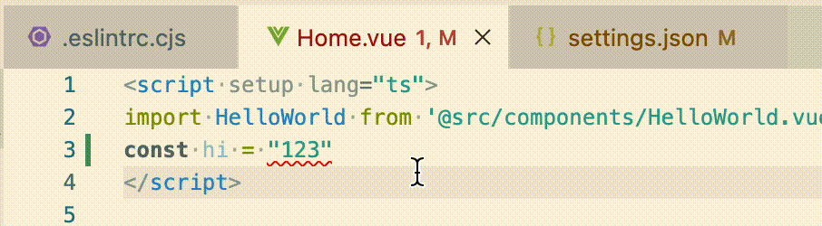
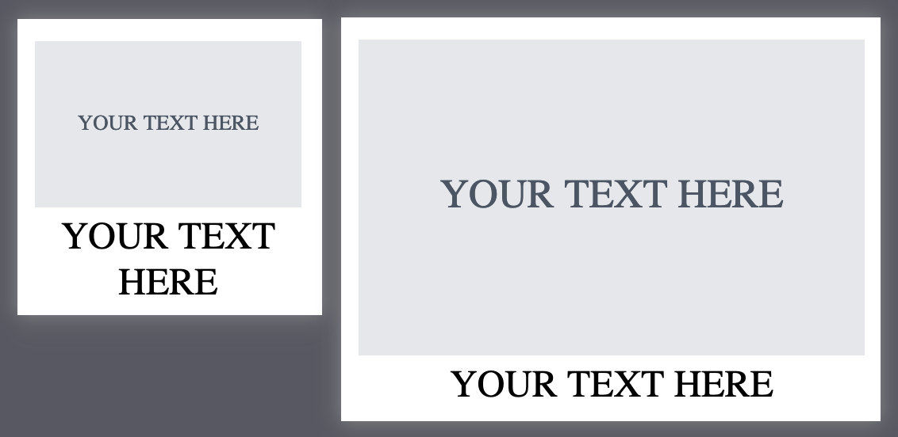

### [Arno - Frontend developer](./resume.html)
> Frontend developer

- Frontend `Vue` / `React` + `TS`

- Backend `Firebase` or `Mongodb` + `Express` + `TS` + `Docker`

- Familiar with `Git`

- Understand the importance of documentation

- Understand English

### [How 3d printer works? ](https://arnosolo.github.io/simple-3d-printer/)

​Hello, I am Arno. Today we are going to find out how 3d printer works by writing a firmware.

### [A better way to pass parameters to functions](./smart-functionparameters-in-javascript.html)

If a function requires 4 arguments, then we need to pass in 4 arguments, even if the middle argument is not needed in some cases. So can you pass in a few parameters if you need a few parameters? Yes, you will know after reading this article.

```ts
// 👎 Ordinary way of passing parameters
printTodo('Learn Swift', undefined, undefined, ['learning']);
// 👍 Pass in only the parameters needed
printTodo({title: 'Learn Swift', tags: ['learning']});
```

### [Vue project auto code formatting](./auto-code-format-vue-ts.html)

Automatically format code on save in vscode / vite / vue3 / ts project.



### [How to convert text into image with svg tag.](./how-to-convert-text-to-image-with-svg-tag.html)

Convert text into image with svg tag. The text is centered and able to wraps automatically.



### [How to convert a string to a number between A and B](./how-to-convert-a-string-to-a-number-between-a-and-b.html)

Use js to convert a string to a number between A and B. Moreover, entering the same string will output a fixed number.


### [How to use js object to store key values pairs](./how-to-save-key-value-using-js-object.html)

Use js object to store key values pairs. To be precise, use the typescript Record type instead of any to store key values pairs to provide better code hints and type checking.