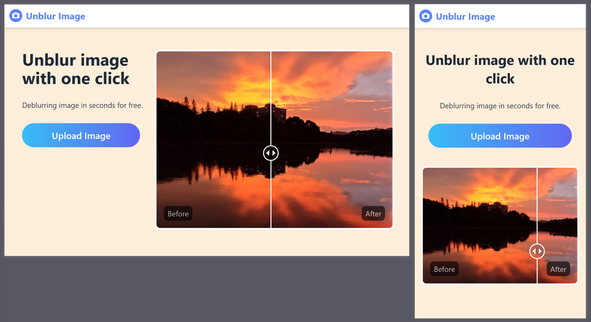
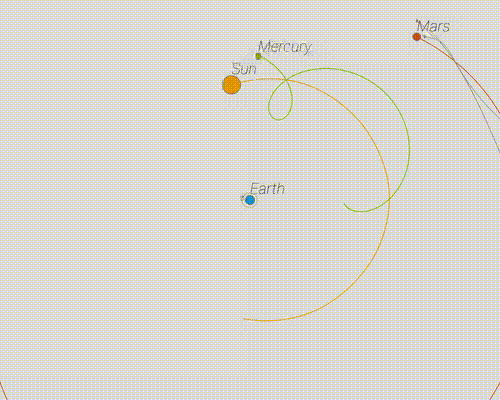

# {{ $frontmatter.title }}

**Fullstack developer**

- Frontend `Vue` / `React` + `TS`

- Backend `Firebase` or `Mongodb` + `Express` + `TS` + `Docker`

- Familiar with `Git`

- Understand the importance of documentation

- Understand English

## Experience

### Frontend Developer

*2022.06 ~ Present* WING SPREAD GROUP LIMITED

- Use Vite / Vue / TS / Unocss to build websites, more in [projects section](#Projects)

### Project Assistant

*2015.02 ~ 2017.12* Ningbo Fuerda Smartech Co., Ltd.

- Audi interior project management (air vent)

## Education

2011.09 ~ 2015.06 Ningbo University of Technology

- Mechanical Engineering

## Projects

### AiPassportPhoto

[AiPassportPhoto](http://aipassportphoto.com/) is a website that can turn a normal photo into a passport photo. And I'm responsible for the frontend.

- Build with Vite / Vue3 / TS / Unocss

- Support **Auto deploy** with Github Action

- Support **Multi-language** with vue-i18n

- Support **Global CDN** with Aws Cloudfront and Aws S3

- Support **Static site generation** with vite-ssg

### Unblur Image

[Unblur Image](https://unblur-image.com/) use artificial intelligence technology to make your old photos clear.

- Frontend is build with `Vite` + `Vue3` + `TS` + `Tailwind css`. **Auto deploy** to aws with Github Action.

- Backend is build with `Express` + `TS`. And deployed on `aws app runner`.

- All use `eslint` to auto format code

## Individual works

### Simple Gravity Simulator

I wrote [this simulator](https://arnosolo.github.io/oversimplified_gravity_simulator/) when I first started learning js. Although it's useless, it's just super fun to look at. You can [click here](https://github.com/arnosolo/oversimplified_gravity_simulator) to understand how it works.

### Simple 3D printer

Before I start learning web development, what I was really interested in was automation equipments. But many years after I left school, I still can't found a relevant internship. So I quit. [This project](https://github.com/arnosolo/simple-3d-printer) is basic 3d printer firmware running on Mega2560 chip. It works but print quality is a little worse than [Marlin](https://github.com/MarlinFirmware/Marlin). I also explained how a 3d printed works on the [readme file](https://github.com/arnosolo/simple-3d-printer#how-3d-printer-works), you can read it if you are interested.

## Others

### Time zone

GMT+8

### Email

<a href=mailto:arno756@outlook.com>arno756@outlook.com</a>

### Nationality

Chinese resident
