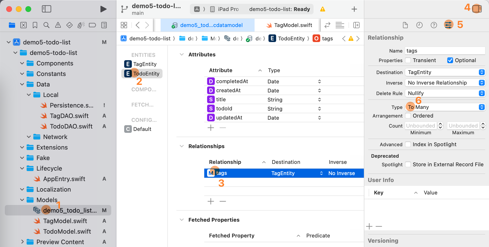

# {{ $frontmatter.title }}

{{ $frontmatter.description }}

## 前提条件

1. [Swift async await](19-swift-async-await)

## 示例代码

[demo5-todo-list](https://github.com/arnosolo/blog/tree/main/codes/demo5-todo-list)

## Core Data 保存数据

### 定义数据类型

我个人的偏好是, 在程序中使用的数据结构叫做`TagModel`, 在 Core Data 中对应的数据结构是`TagEntity`. `TagModel` 的结构在下文中给出. `TagEntity` 请使用 Xcode 的创建一个 xcdatamodeld 文件, 并在其中新建一个 Entity, 名为`TagEntity`
::: code-group
<<< ../../codes/demo5-todo-list/demo5-todo-list/Models/TagModel.swift
:::

### 定义 DAO

您不要看下面这个示例代码很长, 其实所有的 DAO 都长差不多. 下面的 DAO 包含了几个部分:
1. 共享实例
2. 增删改查的方法
3. Model 与 Entity 之间如何进行转化
::: code-group
<<< ../../codes/demo5-todo-list/demo5-todo-list/Data/Local/TagDAO.swift
:::

### 多对多关系

#### 修改 .xcdatamodeld 文件
一个常见的功能是, 一个待办引用了多个标签, 一个标签可以被指派给多个待办. 待办与标签之间的关系是多对多, 如果是使用 SQL 语句操作数据库, 这样的关系需要创建一张关联表来描述两者之间的关系. 但是使用 Core Data 操作数据库时, 我们需要使用图形界面来完成类似操作.
1. 在 TodoEntity > Relationships 界面中增加 `tags` 字段, Destination 选择 `TagEntity`. 打开右侧栏 > Relationship, 选择 Type 为 `To Many`
2. 在 TagEntity > Relationships 界面中增加 `todos` 字段, Destination 选择 `TodoEntity`. 打开右侧栏 > Relationship, 选择 Type 为 `To Many`
3. 选择 TagEntity > Relationships > Inverse 为 `todos`


#### 在 todo 中包含 tags

1. 首先在 `TodoModel` 增加 `tags` 字段.
2. `TodoDAO.updateOne` 方法中加入为 `TodoEntity` 连接上 `TagEntity` 的方法
3. `TodoDAO.entityToModel` 方法中加入将 `TagEntity` 转化为 `TagModel` 的方法
4. 以后新建 `Todo` 时, 先调用 `TodoDAO.createOne` 创建一个 `TodoEntity`, 然后再调用 `TodoDAO.updateOne` 方法为 `TodoEntity` 连接上 `TagEntity`.
::: code-group
<<< ../../codes/demo5-todo-list/demo5-todo-list/Models/TodoModel.swift
<<< ../../codes/demo5-todo-list/demo5-todo-list/Data/Local/TodoDAO.swift
:::

#### 寻找与 tag 关联的 todos

我之前遇到了一个奇怪的问题是, 如果像在 todo 中包含 tags 那样把 `todos` 作为 `TagEntity` 的一个字段, 那么在应用内创建关联完全没有问题, 但是如果进行数据的导入和导出的时候, 应用常常会出现崩溃, 我不明白为什么. 所以, 我采用的方案是如果需要知道与 tag 关联的 todos, 那么并不在 `TagDAO` 中获取 todos, 而是在 `TodoDAO.findMany` 的方法中增加一个 `tagId` 的参数来过滤 todos.

### 一对多关系

#### 定义 LocationModel

::: code-group
<<< ../../codes/demo5-todo-list/demo5-todo-list/Models/LocationModel.swift
:::

#### 修改 .xcdatamodeld 文件
1. 在 TodoEntity > Relationships 界面中增加 `location` 字段, Destination 选择 `LocationEntity`
2. 在 LocationEntity > Relationships 界面中增加 `todos` 字段, Destination 选择 `TodoEntity`. 打开右侧栏 > Relationship, 选择 Type 为 `To Many`

#### 在 todo 中包含 location

写入数据库
```swift
class TodoDAO {
    ...
    func updateOne(todo: TodoModel) async throws {
        ...
        Self.modifyEntity(entity: entity, todo: todo)
        ...
        if let id = todo.location?.id {
            entity.location = LocationDAO.findEntity(id: id, ctx: ctx)
        } else {
            entity.location = nil
        }
        
        try ctx.save()
    }
}
```

从数据库读取
```swift
class TodoDAO {
    static func entityToModel(entity: TodoEntity, ctx: NSManagedObjectContext) -> TodoModel? {
        ...
        var location: LocationModel? = nil
        if let locationEntity = entity.location {
            location = LocationDAO.entityToModel(entity: locationEntity, ctx: ctx)
        }

        return TodoModel(
            todoId: todoId,
            createdAt: createdAt,
            updatedAt: updatedAt,
            title: title,
            completedAt: entity.completedAt,
            tags: tags,
            location: location
        )
    }
}
```

## 分离数据层与视图层

我个人的偏好是,
- 一种数据类型定义一个 `DAO` (Data access object). `DAO` 负责读写本地的 sqlite 数据库.
- 一项后端服务定义一个 `Service`. `Service` 负责与远程数据库进行通讯.
- 一种数据类型定义一个 `Repository`. `Repository` 负责协调数据从本地数据库还是远程数据库获取.
- 在视图中尽量通过调用 `Repository` 而不是 `DAO` 或 `Service` 来读写数据.

下面是一个文件结构的示例:
```yml
Data/
    Local/
        TodoDAO.swift
        TagDAO.swift
    Network/
        FirestoreService.swift
    TodoRepository.swift
    TagRepository.swift
```

下面是 `TodoRepository` 的代码, 目前只有读写本地数据库的代码, 如果以后有服务器请求的代码, 也可以往这个类里写.
::: code-group
<<< ../../codes/demo5-todo-list/demo5-todo-list/Data/TodoRepository.swift
:::

参考资料
- [Building a Data Layer](https://developer.android.com/codelabs/building-a-data-layer#0)