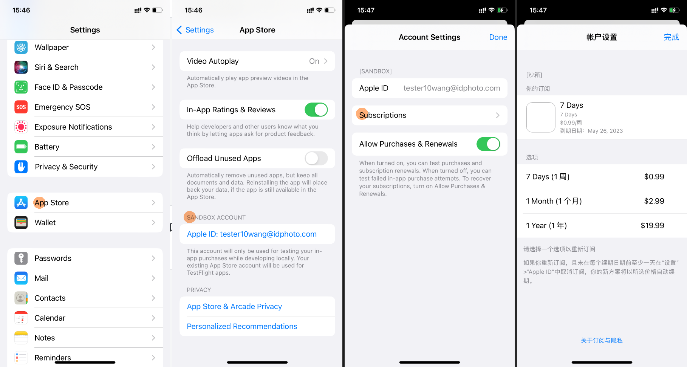

# {{ $frontmatter.title }}

{{ $frontmatter.description }}

## 创建沙盒用户

订阅测试的一个困难之处在于, 最短的订阅周期是一周. 那么这是不是意味着, 如果我订阅了一个商品, 而后退订了一个商品. 那是不是我需要等到一周后才能验证后端的退订处理是否工作正常呢?

答案是并不需要, 我们可以在 [App Store Connect > Users > Sandbox](https://appstoreconnect.apple.com/access/users/sandbox) 网页中创建一个沙盒用户(Sandbox Tester). 沙盒用户的几分钟等于现实世界的一个月. 而且如果沙盒用户订阅了一个商品, 那么这个商品至多会被自动续订6次, 所以过了几个小时, 沙盒用户就自动退订了这个商品.

| Production Subscription Period | Sandbox Subscription Renewal | TestFlight Subscription Renewal |
|---------------------------------|------------------------------|---------------------------------|
| 3 days                          | 2 minutes                    | 1 day                           |
| 1 week                          | 3 minutes                    | 1 day                           |
| 1 month                         | 5 minutes                    | 1 day                           |
| 2 months                        | 10 minutes                   | 1 day                           |
| 3 months                        | 15 minutes                   | 1 day                           |
| 6 months                        | 30 minutes                   | 1 day                           |
| 1 year                          | 1 hour                       | 1 day                           |
> https://www.revenuecat.com/docs/test-and-launch/sandbox/apple-app-store#working-with-subscriptions

## 登录沙盒用户

请在您的 iPhone > Settings > App Store > Sandbox Account 页面中登录您刚刚创建的沙盒账户. 您可以在这个页面中管理当前沙盒账户的订阅.
  

## 测试订阅

注意, 使用 Xcode 安装的应用付款时才会使用沙盒用户. 使用 TestFlight 安装的应用使用的不是沙盒用户, 而是当前 iPhone 登录的 Apple ID.

1. 编写代码, 实现订阅功能
2. 使用 Xcode 安装的应用
3. 点击应用中的订阅按钮, 付款界面会弹出, 付款后订阅状态应变为`已订阅`
4. 强制关闭应用, 再次打开应用, 订阅状态应该依旧是`已订阅`

## 测试退订

1. 打开 Settings > App Store > Sandbox Account 退订刚刚订阅的商品
2. 10分钟后重开应用, 订阅状态应变为`未订阅`

## 测试恢复订阅

1. 再次订阅商品
2. 卸载应用
3. 重新安装应用, 此时订阅状态应为`未订阅`.
4. 点击恢复订阅按钮, 订阅状态应变为`已订阅`
