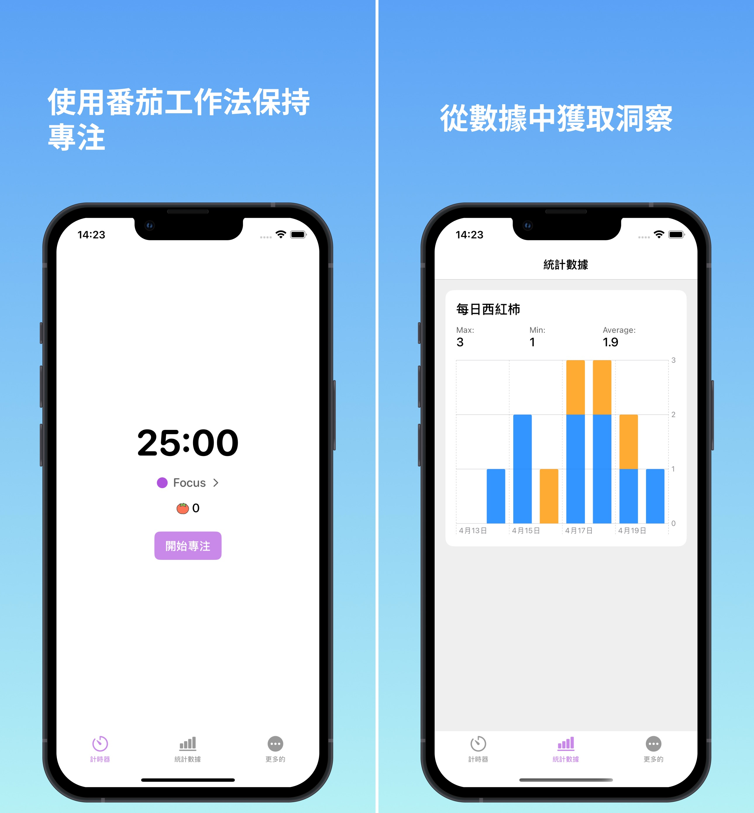

# {{ $frontmatter.title }}

{{ $frontmatter.description }}

保持专注，战胜拖延，并使用我的番茄提高您的工作效率，我的番茄钟计时器应用程序可帮助您更聪明地工作，而不是更努力地工作。

特征 ：

番茄工作法：集中精力进行25分钟的训练，然后休息5分钟。

通知：及时提醒您开始工作和休息 - 绝不错过任何一次会议。

跟踪您的进度：通过详细的会话日志和每日统计数据监控您的工作效率。

简单、直观的设计：干净、易于使用的接口，可帮助您保持专注而不会分心。

无论您是在工作、学习还是处理个人项目，我的番茄都可以帮助您专注于任务并让每一分钟都有意义。

今天就开始吧，用我的番茄掌控您的工作效率——因为您的时间很宝贵！

  

