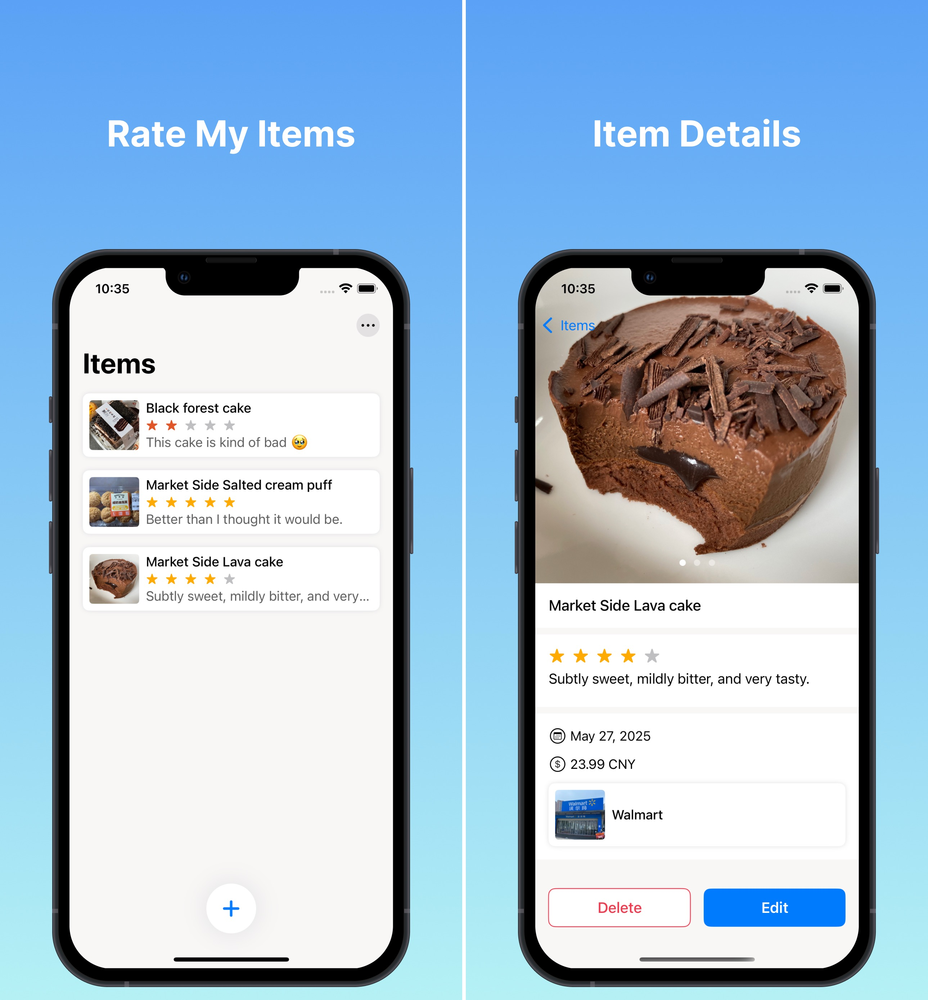

# {{ $frontmatter.title }}

{{ $frontmatter.description }}

你是否曾买过某样东西，心想：“太棒了！”或者“再也不要了”？
使用评分宝，你可以轻松记录并回顾日常物品的使用体验——从美食、数码产品到衣物等等。

例如：

我在沃尔玛花了 23.99 元买了一个巧克力蛋糕——它很好吃！

功能特色：

    记录你购买或使用过的物品

    保存价格、商店信息，以及你的个人评分

    添加备注或照片，帮助你记住特别之处

    随时回顾，为将来做出更明智的选择

非常适合注重消费体验的人、美食爱好者，或者任何喜欢记录“好物与雷品”的你。

现在就开始评价你的世界吧, 一次一个物品。

