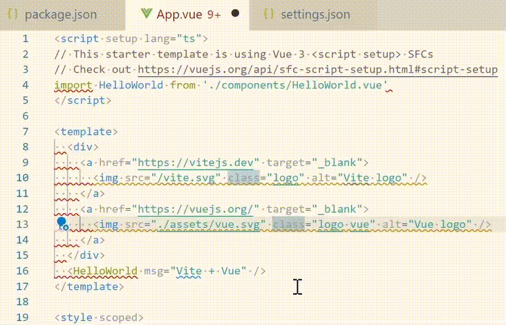

# {{ $frontmatter.title }}

{{ $frontmatter.description }}

## 创建项目

1. 创建项目, 选择 vue + ts
  
  ```bash
  npm create vite@latest
  ```
  
2. 安装依赖, 启动开发模式, 保证开发页面是能打开的
  
  ```bash
  npm install && npm run dev
  ```

## 安装eslint

> [ESlint 主页](https://eslint.org/)

1. 运行以下命令

   ```bash
   npm init @eslint/config
   ```

2. 依次选择

   1. To check syntax, find problems, and enforce code style
   2. JavaScript modules (import/export)
   3. Vue.js
   4. Does your project use TypeScript? › Yes
   5. Browser
   6. Use a popular style guide
   7. Which style guide do you want to follow? Standard
   8. What format do you want your config file to be in? JavaScript

3. 选好了会开始一通安装, 完成后会自动生成一个`.eslintrc.cjs`文件, 此时eslint就安装好了. 默认情况下字符串用双引号eslint会报错. 

    ```ts
    // src/App.vue
    const hi = "sdd"
    ```
   
   

4. 但如果你发现没有报错的话, 那是因为你还没有没有安装eslint插件. 你将需要去插件商店搜索 `dbaeumer.vscode-eslint` 并安装它, 然后你就能看到那沁人心脾的小红线了.


## 保存时自动格式化
  
1. 创建`.vscode/settings.json`, 内容如下.
  
  ```json
  {
    "editor.codeActionsOnSave": {
      "source.fixAll.eslint": true,
      "source.fixAll.stylelint": true
    },
    "editor.formatOnSave": false
  }
  ```
  
2. 现在保存时, vscode就会自动整理代码了

## ESlint文档

这两个文档中记录了代码检查的详细说明, 你将很快用到

[eslint-plugin-vue](https://eslint.vuejs.org/rules/multi-word-component-names.html)

[TypeScript ESLint](https://typescript-eslint.io/)
