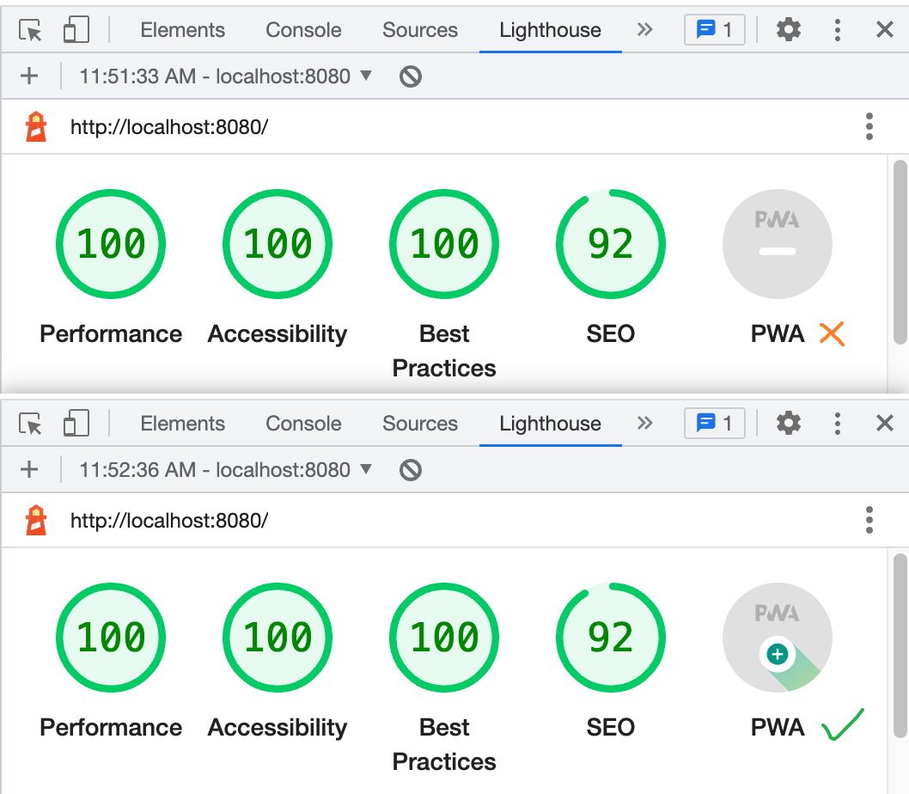
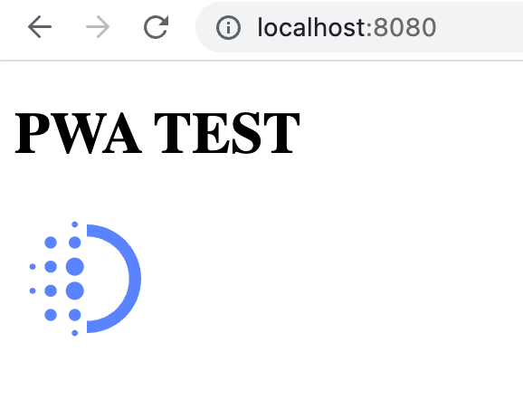

# {{ $frontmatter.title }}

{{ $frontmatter.description }}


## 什么是PWA?

如图所示, 我们今天的任务就是使得我们的网页变成一个**可安装的**小应用.

既然要将**网页**变成**应用**, 那么一个好的问题就是, 网页和应用有什么**区别**. 在我看来的话, 主要是两个

1. 网页的入口是链接, 打开后在浏览器中运行. 应用的入口是桌面图标, 打开有自己的小窗口, 而不是在浏览器中运行.

2. 网页如果不联网的话, 那甚至连页面都加载不出来. 应用如果不联网的话, 大部分功能页就不能用了, 比如说给别人发消息. 但是至少页面能加载出来, 大部分还会贴心的弹出一个红色状态框: 请检查网络连接.

而一个渐进式网页应用, 它作为一个应用而不是网页, 它自然是需要添加对上述两个特性, 也就是在桌面有个小**图标**, 以及**离线访问** 的支持. 体现在代码上就是它比普通的网页项目多了两个文件.

```tsx
index.html
index.js
logo.svg
manifest.json // 生成的应用叫什么名字, 用的是什么图标
service-worker.js // 哪些资源需要缓存, 哪些则是从网络获取
```

## 如何判断当前网页是不是PWA

使用chrome浏览器打开一个你喜欢的网页, 按下f12打开开发者工具, 找到`Lighthouse`标签, 点击分析, 这将会生成一个关于网页状态的报告. 如果这个网页已适配PWA, 那么在报告的最后一项`PWA`的图标中将会包含一个绿色的加号.



## 一个简单的网页

在这一步中, 我们的任务是创建一个网页, 而且可以通过 http://localhost:xxx/ 来进行访问. 你可以选择你熟悉的方式, 这里是一个最简单的例子.



1. 网页 index.html
   
   ```html
   <!DOCTYPE html>
   <html lang="en">
   <head>
       <meta charset="UTF-8">
       <meta name="viewport" content="width=device-width, initial-scale=1.0">
       <meta http-equiv="X-UA-Compatible" content="ie=edge">
       <title>PWA TEST</title>
       <style>
           .w-custom {
               width: 5rem;
           }
       </style>
   </head>
   <body>
       <h1>PWA TEST</h1>
       
       <script src="./index.js" type="module"></script>
   </body>
   </html>
   ```

2. 使用express服务广播网页(可选)
   
    ::: details 点击查看详细步骤
   
   - 安装express
     
     ```bash
     npm init -y && npm i express
     ```
   
   - 编写服务文件
     
     ```js
     // server.js
     const express = require('express')
     const app = express()
     const port = 8080
     app.use(express.static('.'))
     app.listen(port, () => console.log(`Example app http://loaclhost:${port}!`))
     ```
   
   - 启动服务
     
     ```bash
     node server.js
     ```
     
     :::

3. 现在访问 http://localhost:8080/ 就能看到网页内容了. 但是它还是一个简单的网页, 所以如果我们使用`Lighthouse`进行检测的话, 会发现它尚不支持PWA

## 将网页改造为渐进式网页

### 增加manifest.json

1. 首先我们需要在项目中增加一个用于描述应用图标信息的`manifest.json`. 注意, 其中的**icons**属性是**必填**项目, 您可以选择自己制作各个尺寸的应用图标或者使用以下命令自动生成.
   
   ```bash
   npx pwa-asset-generator ./logo.svg icons
   ```
   
    ::: details 点击展开 manifest.json
   
   ```json
   {
       "name": "Try PWA",
       "start_url": "/",
       "icons": [
           {
               "src": "icons/manifest-icon-192.maskable.png",
               "sizes": "192x192",
               "type": "image/png",
               "purpose": "any"
           },
           {
               "src": "icons/manifest-icon-192.maskable.png",
               "sizes": "192x192",
               "type": "image/png",
               "purpose": "maskable"
           },
           {
               "src": "icons/manifest-icon-512.maskable.png",
               "sizes": "512x512",
               "type": "image/png",
               "purpose": "any"
           },
           {
               "src": "icons/manifest-icon-512.maskable.png",
               "sizes": "512x512",
               "type": "image/png",
               "purpose": "maskable"
           }
       ],
       "theme_color": "#5983ff",
       "background_color": "#ffffff",
       "display": "fullscreen",
       "orientation": "portrait"
   }
   ```
   
    :::

2. 其次, 我们将需要在index.html中引入这个文件
   
   ```html
   <title>PWA TEST</title>
   <link rel="manifest" href="manifest.json">
   ```

### 增加service-worker.js

1. 首次, 我们需要向项目中添加`service-worker.js`文件
   
   > [Service workers](https://developer.mozilla.org/zh-CN/docs/Web/API/Service_Worker_API)是由浏览器实现的一个API.  它本质上充当 Web 应用程序、浏览器与网络（可用时）之间的代理服务器。这个 API 旨在创建有效的离线体验.
   
    你会注意到我们引入了一个[Workbox](https://developer.chrome.com/docs/workbox/)的库. 这个库可以使我们更便捷地操作 [Service workers](https://developer.mozilla.org/zh-CN/docs/Web/API/Service_Worker_API) API. 比如说, 在下面这段程序中, workbox设置了如果浏览器需要访问图片的话, 将会优先在缓存中获取.
   
   ```js
   // service-worker.js
   importScripts(
       'https://storage.googleapis.com/workbox-cdn/releases/6.4.1/workbox-sw.js'
   );
   
   workbox.routing.registerRoute(
       ({request}) => request.destination === 'image',
       new workbox.strategies.CacheFirst() // 优先在缓存中获取图片
       // new workbox.strategies.NetworkFirst() // 优先从网络获取
   )
   ```

2. 而后, 我们将在index.js中注册这个配置
   
   ```js
   async function main() {
       if (navigator.serviceWorker) {
           try {
               const res = await navigator.serviceWorker.register('/service-worker.js')
               console.log('service worker registered!');
           } catch (error) {
               console.error(error)
           }
       }
   }
   
   window.addEventListener('load', () => {
       main()
   })
   ```

### 查看效果

现在刷新 http://localhost:8080/ 再次运行`Lighthouse`, 我们将应该能看到PWA图标被点亮了, 同时地址栏右侧会出现一个安装应用的图标. 你可以尝试点击安装, 安装完成后, 你就能从开始菜单或者 Launchpad 启动它了. 


## 深入了解PWA

- [Service Worker API - Web API 接口参考 | MDN](https://developer.mozilla.org/zh-CN/docs/Web/API/Service_Worker_API)

- [Workbox - Production-ready service worker libraries and tooling](https://developer.chrome.com/docs/workbox/)

- [web.dev - Learn PWA](https://web.dev/learn/pwa/) 