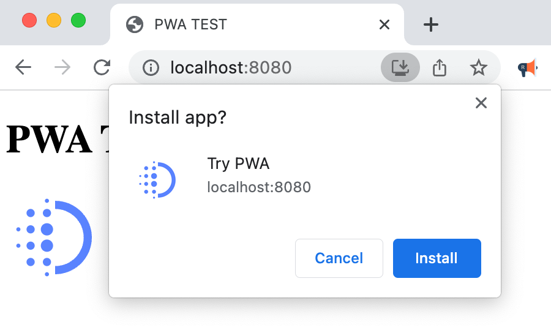

### [黄山 - 全栈工程师](./resume.html)
> 全栈工程师

- 前端 `Vue` / `React` + `TS`

- 后端 `Firebase` 或者 `Mongodb` + `Express` + `TS` + `Docker`

- 熟练使用 `Git` 进行版本管理与代码提交

- 重视文档与注释的编写

- 可使用英语进行交流

### [3D打印机是如何工作的? ](https://arnosolo.github.io/simple-3d-printer/)

大家好, 我是阿诺. 今天将通过实现一个3D打印机固件来理解3D打印机是如何工作的.

### [如何从零开始搭建一个PWA应用](./how-to-build-a-pwa-form-scratch.html)

读完本文, 您将掌握如何搭建一个最简单的PWA(渐进式网页应用)



### [更优秀的函数传参方式](./smart-functionparameters-in-javascript.html)

如果一个函数需要4个参数, 那么我们就需要传入4个参数, 即使中间的参数在一些情况下不需要. 那么能不能做到需要几个参数就传入几个参数呢? 可以, 读了本文你就知道了.

```ts
// 👎 普通的传参方式
printTodo('Learn Swift', undefined, undefined, ['learning']);
// 👍 更佳的传参方式
printTodo({title: 'Learn Swift', tags: ['learning']});
```

### [Vue项目代码自动格式化](./auto-code-format-vue-ts.html)

在保存时自动格式化代码. 适用于 vscode / vite / vue3 / ts 项目.

### [如何将一串字符串转为A到B之间的一个数](./how-to-convert-a-string-to-a-number-between-a-and-b.html)

将字符串转为A到B之间的一个数. 而且来说, 输入相同的字符串会输出固定的数.

### [如何使用svg标签将文字转换为图片](./how-to-convert-text-to-image-with-svg-tag.html)

使用svg标签将文字转换为图片, 而且文字还能居中和自动换行.

### [如何使用js对象存储键值对](./how-to-save-key-value-using-js-object.html)

使用js对象存储键值对. 准确的说是使用typescript的 Record 类型, 而不是 any 来存储对象, 以提供更好的代码提示以及类型检查.

### [ffmpeg 使用方法](./how-to-use-ffmpeg.html)

ffmpeg是一款常被用于音视频转换的命令行工具. 比如说, 将视频转换为音频或者是gif.
