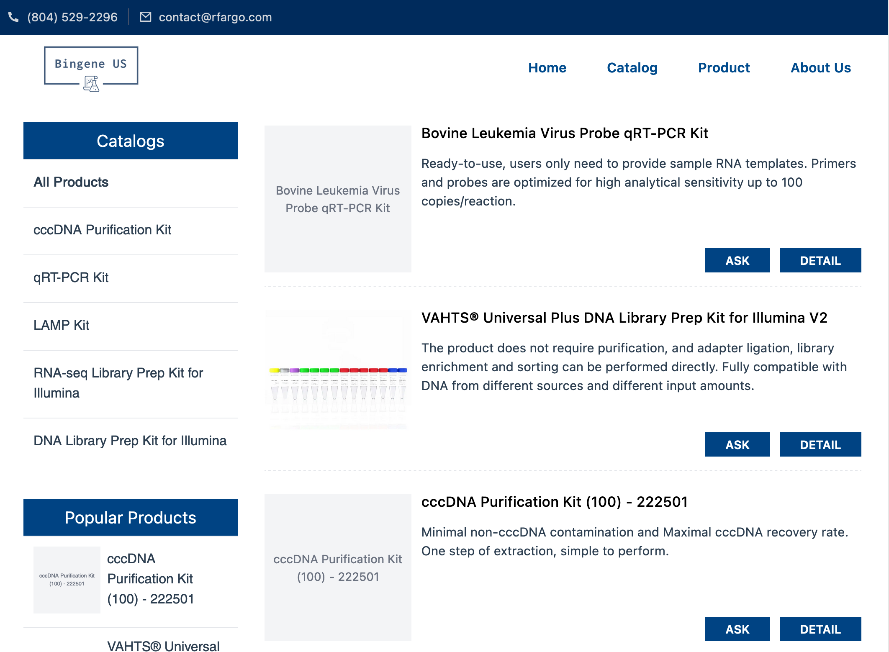
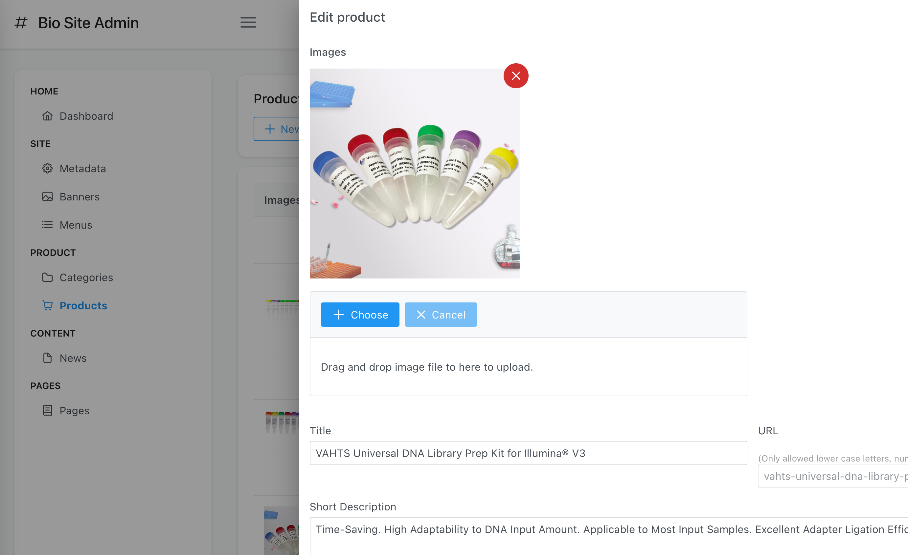
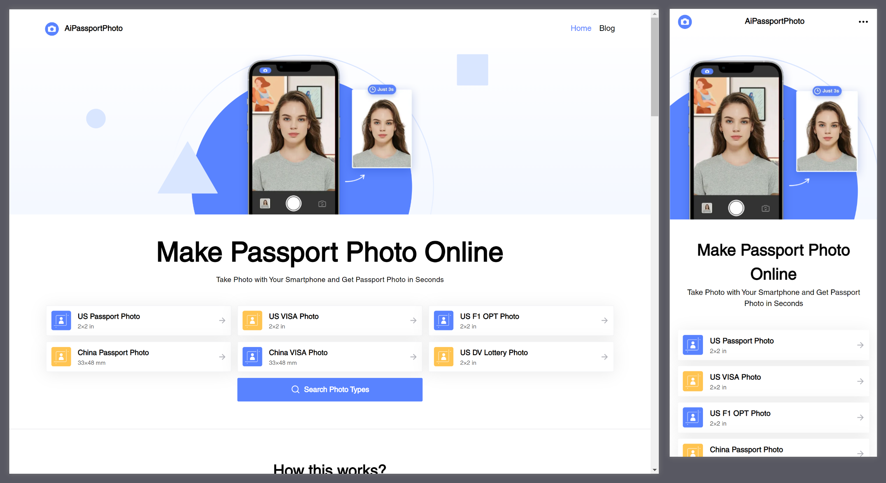

# {{ $frontmatter.title }}

> 前端工程师

- Web端 `Vue` / `React` + `TS`

- 服务端 `Firebase` 或者 `Mongodb` + `Express` + `Docker`

- 熟练使用 `Git` 进行版本管理与代码提交

- 重视文档的编写

- 可使用英语进行交流

## 教育经历

*2011.09 ~ 2015.06*  宁波工程学院

机械设计制造及其自动化 本科

## 工作经历

### 项目管理
 
*2015.02 ~ 2018.01*  宁波福尔达智能科技有限公司

推进奥迪出风口项目的开发. 保证工装/模具/检具能按时交付, 同时拿到大众的材料以及产品认证.

### 待业

*2018.01 ~ 2022.06*  一间城市边缘的出租屋

每天上来先看个抖音, 看累了写一会儿网页休息一下, 写累了便开始奶茶时间, 而后跳到句首开始循环. 你可能会问那你为什么不搬走呢? 因为我不知道我能去哪里.

### 前端工程师

*2022.06 ~ 至今*  WING SPREAD GROUP LIMITED

开发网站, 编写自动部署脚本, 以远程工作的形式.

## 项目经历

### Bio CMS

[这个网站](https://p9gp3ricu5.us-east-1.awsapprunner.com/all-products)是一个内容管理类项目, 包括一个前台的内容展示页面和后台的内容管理页面. 

- 数据库使用的是 `Firebase`

- 前台使用的是 `nuxt` + `ts` + `unocss`.
  
  - 使用 `nuxt` 的原因是为了实现 `SSR` (Server Side Rendering), 以达到更好的 `SEO`.
  
  - 部署在 `aws app runner`上

- 后台使用的是 `vue3` + `ts` + `unocss` + `PrimeVue`组件库
  
  - 使用`Github Action` 实现自动部署, 部署在 `aws s3`上, 使用 `aws cloudfront` 实现CDN

- 前台展示页面

- 后台管理页面

### AiPassportPhoto

[AiPassportPhoto](http://aipassportphoto.com/)被用于去除照片背景获得白底照片. 我做的是前端的部分. 而这个项目的前端部分主要特点有:

- 基本框架使用 [vue3](https://vuejs.org/) + [Typescript](https://www.typescriptlang.org/) 按照官方文档实现组合式api的最佳实践.

- 样式 [Unocss](https://uno.antfu.me/)

- 多语言 [vue-i18n](https://vue-i18n.intlify.dev/), 而且翻译脚本支持增量翻译

- 代码实时检查, 自动格式化, git commit时自动检查 [eslint](https://eslint.org/) + [lint-staged](https://github.com/okonet/lint-staged) + [husky🐶](https://github.com/typicode/husky)

- 它使用了来做类型检查, 而且没有any. 事实上, 我觉得使用js开发比使用ts开发难度要高, 你得有非常好的记忆力和耐心才行.

### Unblur Image

[Unblur Image](https://unblur-image.com/)使用人工智能技术将你的老照片变得清晰. 这个项目写出来的原因是因为这个项目的后端是我完成的.

- 前端继承了[AiPassportPhoto](#AiPassportPhoto)的各个特性

- 后端我使用 [express](http://expressjs.com/) + [Typescript](https://www.typescriptlang.org/) 构建, 部署在 AWS app runner 上.

## 联系

- 邮箱 <a href=mailto:arno756@outlook.com>arno756@outlook.com</a>

- Github [Arno Solo](https://github.com/arnosolo)

## 趣味

> 完全只是有趣而已.

### Simple 3D printer

一个简单的3D打印机固件, 我花了两周的时间使用 `c/c++` 编写的. 编写的目原因是对[3D打印机的工作原理](https://arnosolo.github.io/simple-3d-printer/)有一点点好奇. 没有持续改进的原因是, 虽然有趣, 但是感觉靠嵌入式找不到工作. 而如[上文所述](#待业), 我正在为生存而挣扎, 自是没有什么心情去兴趣中陶醉. 说起来, 我当年在学校的时候学的就是这个, 但是毕业以后也是因为没有找打相关工作, 不了了之了.

### Simple Gravity Simulator

如果你点开[这个项目](https://arnosolo.github.io/oversimplified_gravity_simulator), 你会发现它生成图形界面的方式极其的丑陋, 这让我很难受. 但是也正是因为这种难受, 让我开始学习像 vue ts 这样的技术, 所以它是我的起点. 而且它生成的动画看上去也很有趣啊. 也正是因为这种有趣, 让我开始接触js, 了解如何创建一个类, 如何使用canvas. 所以它还是我的初心.

