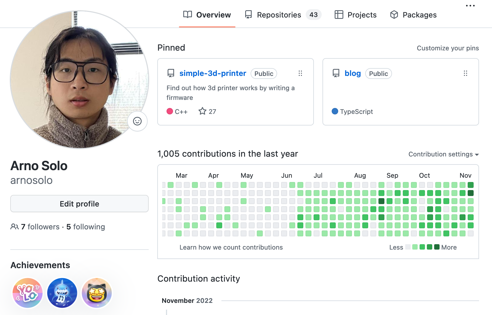

# {{ $frontmatter.title }}
> 前端工程师

- 前端 `Vue` / `React` + `TS`

- 后端 `Firebase` 或者 `Mongodb` + `Express` + `TS` + `Docker`

- 熟练使用 `Git` 进行版本管理与代码提交

- 重视文档与注释的编写

- 可使用英语进行交流

## 工作经历

### 前端工程师

*2022.06 ~ 至今*  WING SPREAD GROUP LIMITED

- 网站开发, 详见[项目经历](#项目经历)

### 项目管理
 
*2015.02 ~ 2017.12*  宁波福尔达智能科技有限公司

- 推进奥迪出风口项目的开发

## 教育经历

2011.09 ~ 2015.06 宁波工程学院

- 机械设计制造及其自动化

## 项目经历

### AiPassportPhoto

[AiPassportPhoto](http://aipassportphoto.com/)被用于去除照片背景获得白底照片. 我做的是前端的部分. 而这个项目的前端部分主要特点有:

- 使用 `Vite` + `Vue3` + `TS` + `Unocss` 构建

- 使用 `Github Action` 实现 **自动部署**

- 使用 `vue-i18n` 实现 **多语言**

- 使用 `aws Cloudfront` 和 `aws S3` 实现 **全球CDN**

- 使用 `vite-ssg` 实现 **静态站点生成(SSG)**

- 使用 `eslint` 实现 **代码自动格式化**

### Unblur Image

[Unblur Image](https://unblur-image.com/)使用人工智能技术将你的老照片变得清晰.

- 前端使用 `Vite` + `Vue3` + `TS` + `Tailwind css` 构建. 使用 `Github Action` **自动部署** 到aws.

- 后端使用 `Express` + `TS` 构建. 部署在 `aws app runner` 上

- 前后端使用 `eslint` 实现 **代码自动格式化**

## 个人作品

### Simple 3D printer

一个简单的3D打印机固件, 使用 `c/c++` 编写, 可运行在`Mega2560`上. 编写的目的是为了解释[3D打印机的基本工作原理](https://arnosolo.github.io/simple-3d-printer/).

### Simple Gravity Simulator

这是我多年前初学js的时候编写的第一个网页. 它可以模拟引力, 进而生成一些有趣的动画. 使用`canvas`绘制. [点此](https://github.com/arnosolo/planet-simulation-animation)了解绘制原理, [点此](https://arnosolo.github.io/oversimplified_gravity_simulator/?config=init_condition-three_bodies-figure_8_solution)查看三体动画

## 其他

### 时区

GMT+8

### 联系

<a href=mailto:arno756@outlook.com>arno756@outlook.com</a>

### Github

[github - arnosolo](https://github.com/arnosolo)

### 国籍

中国居民
