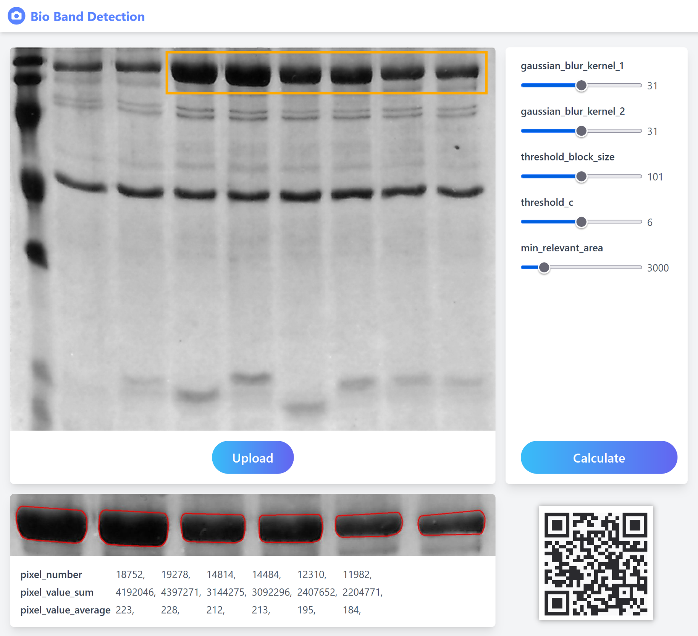
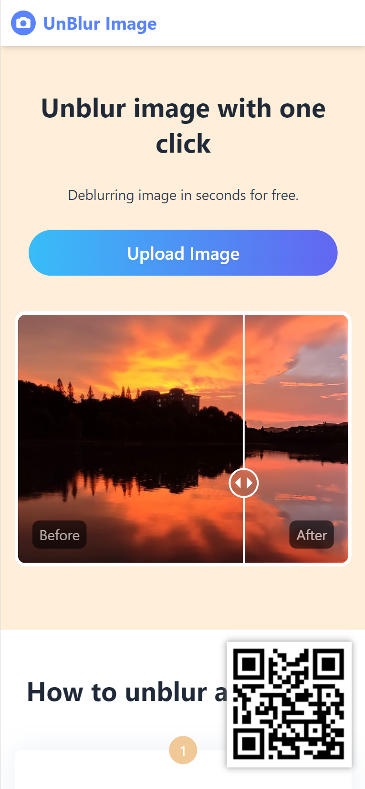
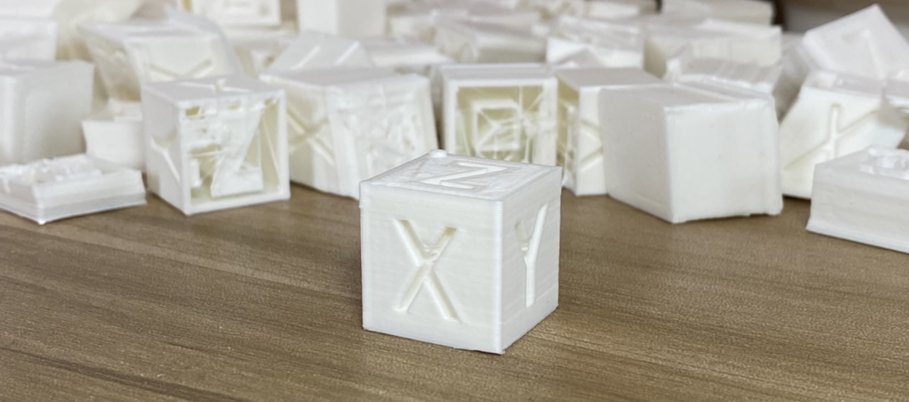

# 黄山

✔ 汽车内饰开发经验(奥迪)

✔ 编写网页(Vue / TS / Firebase)

✔ 单片机(写过基础的[3d打印机固件](https://github.com/arnosolo/simple-3d-printer))

✔ 英语流利

### 教育经历

2011.09 ~ 2015.06 宁波工程学院

- 机械设计制造及其自动化

### 工作经历

2015.02 ~ 2017.12 宁波福尔达智能科技有限公司

- 出风口项目管理
  
  - 获得大众的产品认证
  
  - 获得大众的材料认证
  
  - 验收检具
  
  - 验收模具
  
  - 验收工装

2022.06 ~ 至今 个人雇主

- 多个网站的开发与维护

### 项目经验

#### AiPassportPhoto

- 去除照片背景获得白底照片

- 多语言 / 静态化 / 全球CDN / 自动部署

- [Link](http://aipassportphoto.com/)

#### Bio Band Detection

- 寻找图形轮廓, 计算像素数量

- Vue / TS / Tailwind css / AWS / Github Action

- [Link](https://d12zy233hhl7j9.cloudfront.net/) 

#### Unblur Image

- 使用人工智能技术提升图片的清晰度, 当然啦, 这个模型不是我训练的, 是 Aliyun 提供的

- Vue / TS / Tailwind css / Github Action / Firebase / Aliyun

- [Link](https://unblur-image.com/) 

#### Simple Gravity Simulator

- 行星运行动画, 使用`canvas`绘制. [点此](https://github.com/arnosolo/planet-simulation-animation)了解绘制原理, 更有[三体动画](https://arnosolo.github.io/oversimplified_gravity_simulator/?config=init_condition-three_bodies-figure_8_solution)可供欣赏
  
  

#### Simple 3D printer

- 一个简单的3D打印机固件, 可运行在`Mega2560`上, 效果略差于Marlin. [点此](https://github.com/arnosolo/simple-3d-printer)可阅读3D打印机的基本工作原理.

### 其他

#### 时区

GMT+8

#### 联系

arno756@outlook.com

#### 国籍

中国居民
